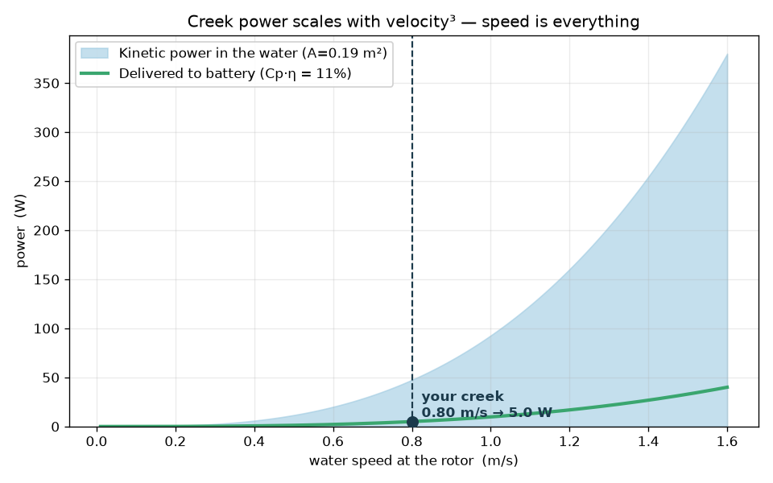
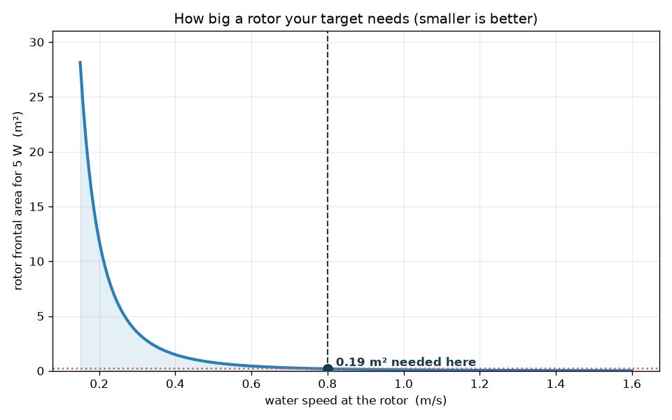
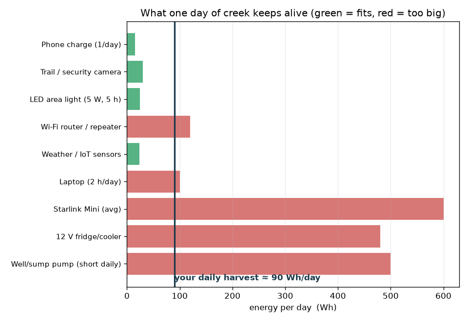
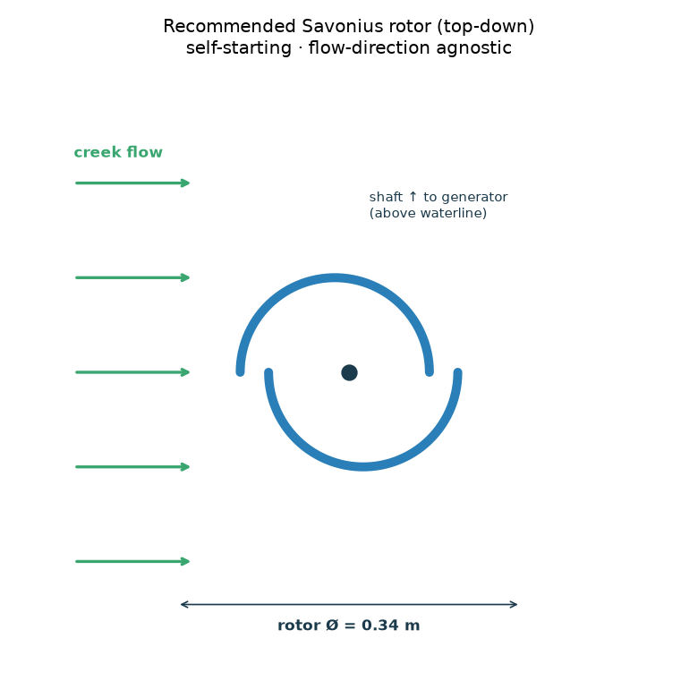
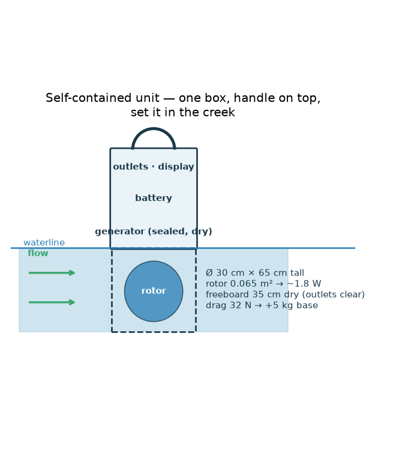

# CreekTurbine 🌊⚡

A DIY **hydrokinetic** turbine you can drop into a creek — an "underwater wind
turbine" that harvests the *kinetic* energy of the moving stream to trickle-charge
a battery. No dam, no vertical drop, removable before floods.

> **Status: Phase 0 — the honest-numbers toolkit.** A config-driven physics
> engine sizes a turbine for *your* creek, matches a generator, sizes a battery,
> and tells you what it can actually run — today, with **zero hardware**. You only
> fill in three things you measure with a tape and a stopwatch. Parametric CAD for
> the printed parts is included and exports clean STEP/STL.

```bash
pip install -r requirements.txt
python -m scripts.measure_creek        # how to measure your creek (float method)
python -m scripts.size_turbine --figs  # size the turbine + render figures to ./output
python -m pytest                       # 46 checks on the physics
```

---

## Read this first: a creek is a *trickle-charger*, not a generator set

The power in moving water is `P = ½·ρ·A·v³`. That **v³** is the whole story:
double the water speed and you get **8×** the power. Two creeks that look the same
to your eye can differ 8× in what they'll make. So:



- **Measure your creek's speed honestly** — it dominates everything else.
- A gentle 0.5 m/s creek yields a few watts; a brisk 1 m/s creek, tens of watts.
- **A few watts, 24/7, is genuinely useful.** 5 W around the clock ≈ **90 Wh/day**
  — enough to keep phones, trail/security cameras, LED lights, and IoT sensors
  alive indefinitely (a ~10 W always-on Wi-Fi router or a laptop needs a bit more
  creek). It is **not** going to run a fridge or a house.

The toolkit's job is to tell you the truth for *your* water before you spend a
dollar — and to show you the two free levers that beat buying bigger gear:
**measure the fastest spot**, and **speed the water up** with a chute or shroud
(since power ∝ v³, a 1.2× speed-up is a ~1.7× power gain).

---

## What it tells you (real output for the default creek)

`python -m scripts.size_turbine` on the placeholder creek (0.8 m/s, 1.5 m × 0.5 m
channel, 5 W target):

```
 TARGET: 5.0 W continuous at the battery
   → Savonius rotor: Ø 0.34 m × 0.54 m tall  (frontal area 0.19 m²)
   Blocks 25% of the wetted channel — comfortable.
   At 0.80 m/s: shaft ≈ 40 rpm, torque ≈ 2.0 N·m, mechanical ≈ 8.5 W → battery ≈ 5.0 W
 GENERATOR MATCH (the part people get wrong):
   Rotor turns ~40 rpm — that's SLOW. For a 12 V bus to cut in at your low-season
   ~0.48 m/s, pick a PMA with Ke ≈ 0.5 V/rpm (≈ 2 rpm/V).
 ENERGY: 5.0 W × 24 h × 75% uptime ≈ 90 Wh/day  (33 kWh/year)
 BATTERY: 19 Ah at 12 V (LiFePO4) for 2 days autonomy
 WHAT IT RUNS:  ✓ phone  ✓ security cam  ✓ LED light  ✓ sensors  ✗ Wi-Fi  ✗ laptop  ✗ fridge
```

It also renders these:

| Size vs. velocity | Daily energy budget | Recommended rotor |
|---|---|---|
|  |  |  |

---

## Why a Savonius (vertical-axis) turbine

The default design is a **Savonius** — a vertical-axis drag rotor (think two
scoops making an S). Its power coefficient isn't the best (a propeller wins on
paper), but it's the best *system* for a real DIY creek:

- **Self-starts in slow water**, where a propeller just stalls.
- **Doesn't care which way the flow points** — creeks meander and eddy.
- **Vertical shaft ⇒ the generator sits on top, above the water.** This turns the
  single hardest problem — keeping a generator dry — into "bolt it to a plate in
  the air." Only the bearings get wet.
- **Debris-tolerant, low-rpm/high-torque, buildable from a barrel or PVC pipe.**

The costs — a bigger rotor per watt and a slow shaft that needs careful generator
matching — are shown explicitly, never hidden. Got a brisk, deep creek? Set
`TURBINE_TYPE = "axial"` and the model sizes the higher-efficiency propeller
instead. Details in **[docs/ARCHITECTURE.md](docs/ARCHITECTURE.md)**.

### Want an enclosed underwater box with a dry generator inside?

Yes — that's a *ducted turbine with a dry nacelle*, and it's modeled in
`ducted.py` / `scripts/box_turbine.py`. The honest punchline: a box around a
purely *kinetic* rotor gains little (a creek's speed is worth only ~3 cm of
head), **but building in a small elevation drop turns it into a low-head turbine
worth ~30× more** for the same opening. Cross the wet/dry wall with a **magnetic
coupling** (no shaft seal to leak), and mind that a submerged air box is very
buoyant. Full write-up: **[docs/BOX_AND_DUCT.md](docs/BOX_AND_DUCT.md)**.

### Want to carry it to any creek (camping / backyard)?

That's a **portable power station** — a sealed drop-in turbine, a *low-voltage DC*
cable to shore (never mains AC in the water), and a battery-buffered box on dry
land. The battery is the trick: loads run off it while the turbine tops it up, so
you get smooth, instant power and it works **24/7 — at night and in rain, unlike
solar**. A multi-input controller lets the same battery also charge from solar or
a wall outlet (your "switch between sources"). Modeled in `portable.py` /
`scripts/portable.py`; full write-up: **[docs/PORTABLE.md](docs/PORTABLE.md)**.

### Or fully self-contained — one box with a handle you set in the creek?

The cleanest form, and the vertical-axis design makes it natural: **one housing,
rotor at the bottom (wet), battery + generator + outlets stacked above the
waterline (dry), handle on top.** Set it in the stream and the outlets are live —
no cable, plug-and-play. The real catch is *stability* (a free-standing box in
current wants to slide/tip, so its base needs weight or a stake), which the model
sizes. Modeled in `selfcontained.py` / `scripts/self_contained.py`; full write-up:
**[docs/SELF_CONTAINED.md](docs/SELF_CONTAINED.md)**.



### Want the highest-Cp rotor that still survives the creek?

A cited literature pass (**[docs/RESEARCH_ROTORS.md](docs/RESEARCH_ROTORS.md)**)
found the sweet spot: an **optimized/hydrofoil, helical Savonius**. Verified
results — a cambered-hydrofoil blade nearly **doubles Cp** (~0.26 vs ~0.13 at
0.4 m/s), and arc-angle/overlap/aspect + end-plate tuning reaches ~0.19 — while
keeping the blunt, self-starting, debris-shedding toughness a lift rotor throws
away. Selectable in `config.py` (`SAVONIUS_PROFILE = "conventional" | "optimized"
| "hydrofoil"`), and there's a printable **helical blade** in `cad/`.

---

## How it works (the modules)

1. **`hydrokinetics.py`** — the physics you must trust: `½·ρ·A·v³`, the Betz limit
   (16/27), rotor sizing, rpm/torque, flow-augmentation. Tested against
   hand-computed values.
2. **`rotor.py`** — Savonius & axial rotors behind one interface; turns a power
   target into rotor dimensions.
3. **`generator.py`** — the part people get wrong: **cut-in velocity** (below which
   you make *nothing*) and a Ke recommender to match your low-season flow.
4. **`energy.py`** — daily/annual Wh, battery Ah sizing, and the "what it runs" table.
5. **`siting.py`** — float-method + cross-section math to measure your creek.
6. **`simulator.py`** — renders all of it to PNGs (headless).
7. **`ducted.py`** — the "enclosed underwater air box" / ducted low-head turbine:
   flow-through-a-throat, the huge payoff of building in a little *head*, and how
   much ballast a submerged air box needs. See **[docs/BOX_AND_DUCT.md](docs/BOX_AND_DUCT.md)**.
8. **`portable.py`** — the carry-anywhere **power-station** build: battery-buffer
   runtime (sustained vs. burst), the waterproof low-voltage-DC cable to shore
   (volt-drop & gauge), and pack weight. See **[docs/PORTABLE.md](docs/PORTABLE.md)**.
9. **`selfcontained.py`** — the all-in-one "box with a handle": rotor-fits-box +
   freeboard geometry, and the drag/sliding/tipping math that sizes the base so
   the current can't move it. See **[docs/SELF_CONTAINED.md](docs/SELF_CONTAINED.md)**.

---

## Repository layout

```
creekturbine/
  config.py          # ← the ONLY file you edit: your creek, your goal, your battery
  hydrokinetics.py   # ½·ρ·A·v³, Betz, sizing, rpm/torque, augmentation
  rotor.py           # Savonius + axial rotor models (one interface)
  generator.py       # PMA cut-in velocity + Ke matching (the classic failure point)
  energy.py          # daily/annual energy, battery sizing, what-it-runs
  siting.py          # measure-your-creek math (float method, cross-section)
  ducted.py          # enclosed-box / ducted low-head turbine + buoyancy/ballast
  portable.py        # carry-anywhere power station: battery buffer, cable, weight
  selfcontained.py   # all-in-one "box with a handle": fit, freeboard, drag/tipping
  simulator.py       # renders the figures (matplotlib, headless)
scripts/
  measure_creek.py   # walk through measuring velocity & flow
  size_turbine.py    # end-to-end sizing report (+ --figs)
  box_turbine.py     # model the enclosed underwater air-box idea
  portable.py        # model the portable power-station build
  self_contained.py  # model the all-in-one box unit (+ --figs)
  demo_sim.py        # render the whole picture book to ./output
cad/
  params.py          # printed-part dimensions (mm) — edit to match your hardware
  parts/             # end plate ×2, shaft coupler, generator mount (parametric)
  export_all.py      # -> cad/step/*.step + cad/stl/*.stl
tests/               # 46 checks on the physics/energy/generator/siting math
docs/
  ARCHITECTURE.md    # how the pieces fit + design decisions
  SITING.md          # measure first, then make the water faster (+ permits)
  BOX_AND_DUCT.md    # the enclosed underwater air-box idea, costed (dry generator + head)
  PORTABLE.md        # carry-anywhere power station (cable, battery, source-switching)
  SELF_CONTAINED.md  # all-in-one "box with a handle" set-in-the-creek unit
  RESEARCH_ROTORS.md # cited survey: high-Cp + durable rotor geometries (+ comparison table)
  SAFETY.md          # water + electricity + a spinning rotor: read this
  HARDWARE.md        # BOM + the generator problem (cut-in, low rpm)
  ROADMAP.md         # phase-by-phase build plan
  RESEARCH.md        # the physics & why the default coefficients
```

---

## Where this is going

| Phase | What | Cost |
|------|------|------|
| **0** ✅ | Physics/sizing engine, rotor+generator+energy models, simulator, tests, CAD | Free |
| **1** | Measure your creek (2+ seasons), lock rotor size & generator Ke | ~$0 |
| **2** | Bench-build rotor + generator, prove **cut-in** and charging | 💰 generator + battery |
| **3** | Wet install: frame, anchoring, trash rack, **dump load**, sealed electronics | 💰 ~$250–450 |
| **4** | Flow augmentation (chute/shroud) + flood/winter survival | 💰 iteration |

The genuinely hard, risky parts are called out honestly: **matching a generator
to a slow shaft**, **keeping it dry and alive in a creek**, and the **legal/
environmental** rules you must settle *before* building. See
**[docs/ROADMAP.md](docs/ROADMAP.md)**.

> ⚠️ **Before you build, read [docs/SAFETY.md](docs/SAFETY.md).** A hydro source
> runs 24/7 and can't be switched off like a solar panel — it *needs* a charge
> controller with a dump load, a fused battery, and sealed, elevated electronics.
> And check your **water rights and fish-passage rules** first
> ([docs/SITING.md](docs/SITING.md)).
