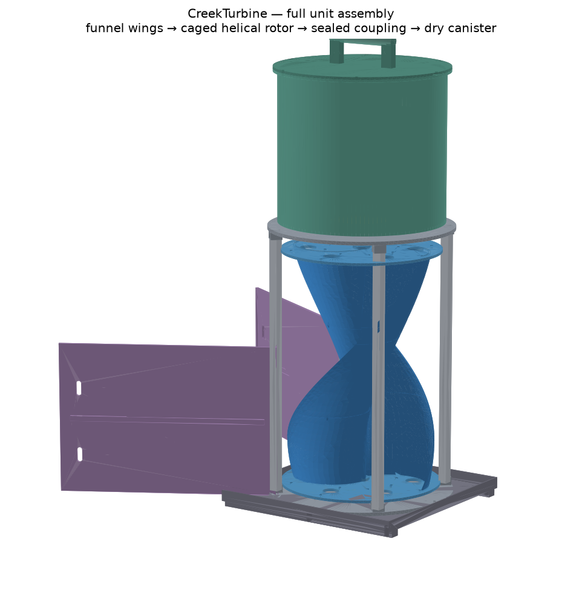
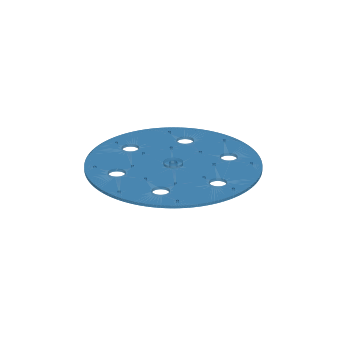
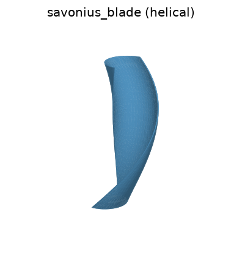
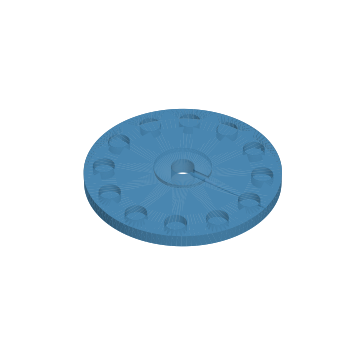
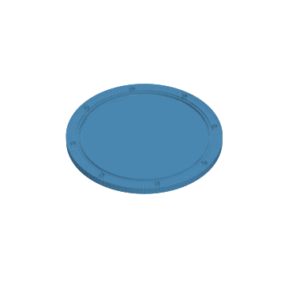
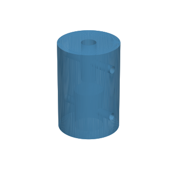
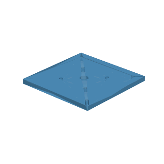

# CAD — the printed & cut structure

**The complete unit is modeled** — every physical piece of the machine, on one
parametric dimensional chain (blade → end plate → housing bore → cage → skid),
so changing `ROTOR_DIA`/`ROTOR_HEIGHT` re-derives everything:



The Savonius rotor's **scoops** are cut from cheap PVC pipe or sheet (not
printed). What's parametric here is the **structure that holds them and carries
the shaft up to the dry generator**:

| Part | What it is | Print notes |
|------|-----------|-------------|
| `end_plate` | Top & bottom discs with **profile-matched grooves** that seat the blade ends (a twisted edge can't take a bolt — it drops into its groove and is epoxied; bolt rings become clamping/through-rod holes). Print **2** identical; clock the top one to the blade twist at assembly. | PETG, 4+ walls, 40%+ infill. At Ø370 mm it exceeds most beds — **cut from HDPE sheet/plywood using the STEP as a template** for full-size rotors; print only small ones. Overhangs the scoops on purpose (raises Cp). |
| `savonius_blade` | Helical Savonius scoop — **one printable SEGMENT** (a full blade exceeds every consumer printer's Z). Print **`SCOOP_COUNT × BLADE_SEGMENTS`** copies (default 2×3); segments are identical — stack each rotated by `BLADE_SEG_TWIST`, register on 3 mm pins (filament) in the end-face holes, epoxy the joints. | PETG/ASA, 4+ walls; print upright. Twist = `BLADE_TWIST_DEG`; set 0 for straight. `BLADE_SEGMENTS` auto-computes from `PRINTER_MAX_Z`. |
| `shaft_coupler` | Joins the rotor shaft to the generator shaft; radial set screws. | Print solid-ish (PETG/ABS/nylon), or buy a metal coupler and use this as the fit reference. |
| `mag_coupling_disc` | Magnetic-coupling disc — ring of magnet pockets + shaft hub. Print **2** (wet + dry). Seals the wet→dry crossing with no shaft seal. | PETG; press magnets in alternating polarity. Seal/pot the wet disc's magnets. See [MAG_COUPLING.md](../docs/MAG_COUPLING.md). |
| `bulkhead` | The sealed wall the coupling drives through: thin center membrane + bolted, O-ring-grooved rim. | **Don't print it** — it's a flat disc: **cut from 3 mm PC/acrylic/FR4 sheet** using the STEP as a drill template. **NON-MAGNETIC only** — never plain steel. |
| `trash_rack` | Barred intake screen that sheds debris (the #1 field failure). Print **1+**. | PETG/ASA; angle it downstream-leaning. Size open area via `siting.screen_*`. |
| `generator_mount` | Top plate the PMA bolts to, standing above the waterline on legs. | PETG, 5+ walls. |
| `cage_ring_top` | Top of the open wet cage: sockets the 4 columns, carries the shared 8-bolt clamp circle (cage → bulkhead → housing floor in one stack). Print **1**. | PETG/ASA, 5+ walls. |
| `cage_ring_bottom` | Cage base disc: column sockets, raised lower-bearing boss (silt has to climb), drain holes, skid bolt circle. Print **1**. | PETG/ASA. Bearing seat = `BEARING_OD` flanged stainless. |
| *(cage columns)* | **BUY, don't print**: 4 × 20 mm aluminium square tube cut to `CAGE_COL_LEN` — stiffer and cheaper than any print, and a 600 mm part fits no bed. | Hacksaw + deburr; clamp screws hold them. |
| `housing_upper` | The dry canister: sealed floor (bulkhead clamps under it), shell, lid flange, outlet-panel cutout. Print in sections **or roll from HDPE/PVC pipe** (STEP = cut/drill template). | Ø384 — pipe/sheet at full size. |
| `lid_handle` | Gasketed lid + the carry handle (takes the unit's full weight — thick bar, wide posts). Print **1**. | PETG/ASA, high infill in the posts. |
| `skid_base` | Skid + ballast tray: sacrificial runners underneath (cut from UHMW ideally), perimeter ballast tray, cage bolts, corner stake + tether holes. | Runners = replaceable wear parts. |
| `funnel_wing` | Converging-intake wing wall (make **2**, one flipped): mounting flange to a cage column, mid-height rib, stake slots. | **Cut from 6 mm HDPE sheet** at full size (STEP = template); print for small units. |
| `magnet_cover` | Thin bonded cover disc sealing the WET coupling disc's potted magnets — the marine barrier, not a glue dab. Print **1** (or cut from 1 mm PC). | Bond in wet epoxy over the potted face. |

Load-bearing, permanently-wet parts — the **shaft, fasteners, bearings** — are
**metal (stainless)**, never printed.

      

## Regenerating

```bash
pip install -r requirements-cad.txt        # heavy: pulls OpenCascade
# 1. edit cad/params.py — especially SHAFT_DIA, GEN_SHAFT_DIA, GEN_BODY_DIA,
#    GEN_BOLT_CIRCLE to match the parts you actually buy, and ROTOR_DIA /
#    ROTOR_HEIGHT to match `python -m scripts.size_turbine`
python -m cad.export_all                   # writes cad/step/*.step + cad/stl/*.stl
```

The committed STEP/STL match the defaults in `cad/params.py` (which mirror the
recommended rotor from the default `config.py`). **Always sanity-check the mesh
in your slicer before printing** — the bolt patterns are a sensible starting
point, not a guarantee they line up with your specific scoop pipe.

## Printing for water

- **PETG** is the sweet spot: cheap, tough, low water absorption, UV-OK for a
  season. **ASA/ABS** if you want better UV life. Avoid bare **PLA** underwater
  — it creeps and slowly hydrolyzes.
- Print **watertight**: 4–6 perimeters, 30–50% infill, and consider a wipe of
  epoxy on the end plates for a multi-season part.
- Anything structural underwater should really be **metal**; treat printed parts
  as brackets and jigs, not the primary wet load path.

### Scuff- / abrasion-resistant outer shell

The housing drags on gravel and takes rock knocks, so the **outer** wants to be
tougher than a printed wall:

- **Best: HDPE or UHMW-PE** — a cut plastic barrel, sheet, or machined block. It's
  what kayaks and cutting boards are made of: extremely scuff/abrasion resistant,
  tough, near-zero water absorption. (Trade-off: hard to 3D-print or glue — bolt
  and gasket it instead.)
- **Printed alternative: ASA** (UV + impact) or **PCTG / PETG-CF**, with a thick
  wall — then add a rugged skin: a **truck bed-liner coating** (e.g. roll-on
  polyurethane) sprayed over the shell resists scuffs well.
- **Sacrificial bottom skid + corner bumpers:** a bolt-on **UHMW skid plate** on
  the base and **TPU bumpers** on the corners take the abuse and are cheap to
  replace. This is the highest-value scuff protection for the least effort.

